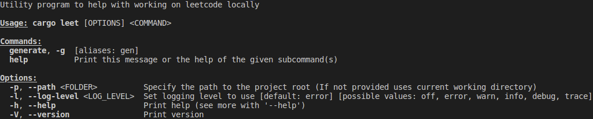
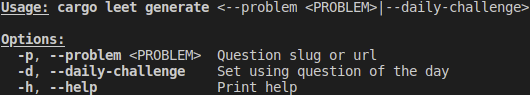

## cargo-leet - A leetcode local development assistant

A program that given the link or slug to a leetcode problem,
creates a local file where you can develop and test your solution before post it back to leetcode.

## ScreenShots

### `cargo leet`



### `cargo leet generate --help`



## Using Library Support

Using the library to "mimic" leetcode environment. Add library as a dependency as below. Then add use statements as necessary. The use statements are automatically added if tool is used to generate the file for the problem.

```toml
cargo-leet = { git = "https://github.com/rust-practice/cargo-leet.git", branch = "develop" }
```

## Tool Installation

NB: If cargo-leet is already installed you do the install it will just replace it even it it was previously installed from a different source. For example if you install it from a clone then run the command to install from git it will replace the existing version that is installed (they will not both be installed).

### From GitHub

```sh
cargo install --git https://github.com/rust-practice/cargo-leet.git --branch main --features=tool
```

### From Clone

After cloning the repo run

```sh
cargo install --path . --features=tool
```

or using alias from `.cargo/config.toml`

```sh
cargo i
```

## Running Directly from source without install (When developing the tool)

These commands allow you to run the tool directly from the source code without installation.
By default they will run the tool on the current working directory.
This means that it will run in the current project folder for cargo-leet.
This may be fine for testing but if you want to be able to actually run the code,
it might be more appropriate to pass the path parameter and specify the path to the repository you want to to run against.
Eg. `cargo g --path $TEST_REPO`
For more options see [generate help](#cargo-leet-generate---help)

```sh
cargo run --features=tool -- leet gen
```

or using alias from `.cargo/config.toml`

```sh
cargo g
```

## Tool Uninstallation

```sh
cargo uninstall cargo-leet
```

## License

All code in this repository is dual-licensed under either:

- Apache License, Version 2.0 ([LICENSE-APACHE](LICENSE-APACHE) or http://apache.org/licenses/LICENSE-2.0)
- MIT license ([LICENSE-MIT](LICENSE-MIT) or http://opensource.org/licenses/MIT)

at your option.
This means you can select the license you prefer!
This dual-licensing approach is the de-facto standard in the Rust ecosystem and there are very good reasons to include both as noted in
this [issue](https://github.com/bevyengine/bevy/issues/2373) on [Bevy](https://bevyengine.org)'s repo.

### Contribution

Unless you explicitly state otherwise, any contribution intentionally submitted
for inclusion in the work by you, as defined in the Apache-2.0 license, shall
be dual licensed as above, without any additional terms or conditions.
